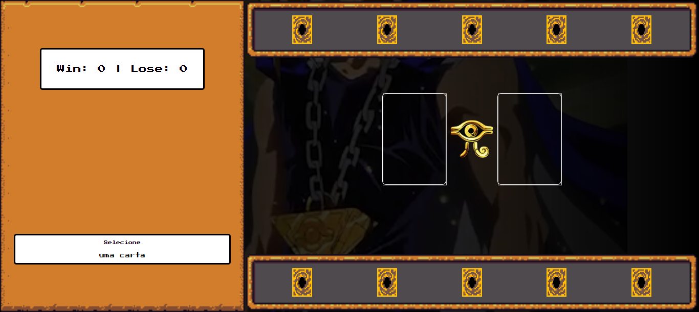
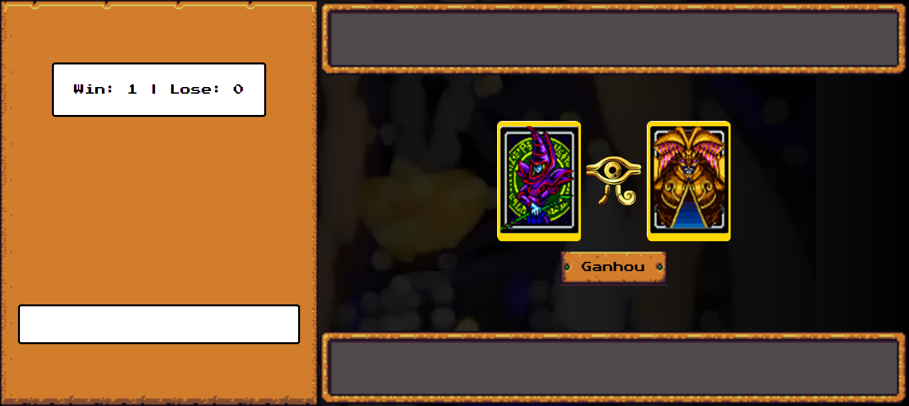
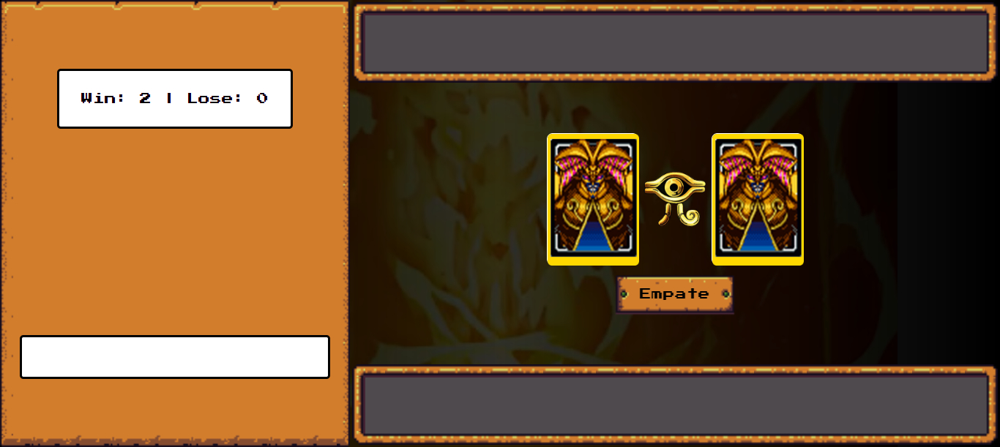
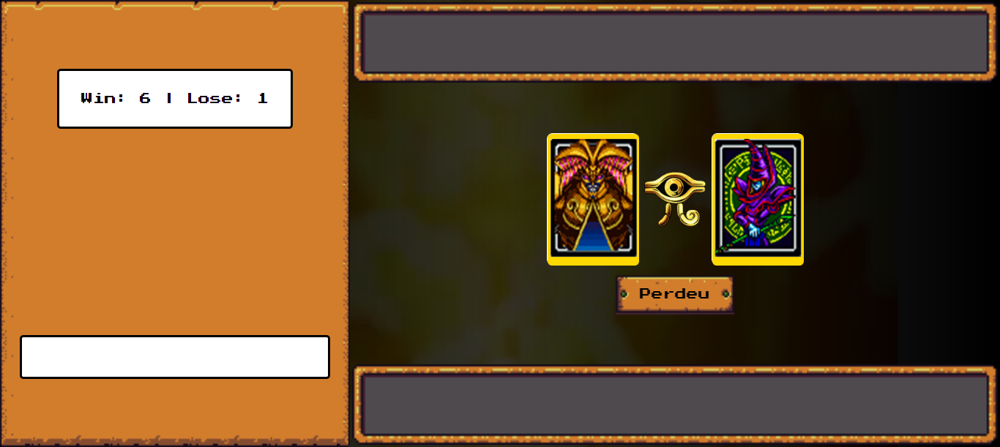

# Game Challenge Yu-Gi-Oh

## Tecnologias utilizadas

* HTML5 e CSS3 para a estrutura e aparência do jogo.
* JavaScript para a lógica de programação e interatividade.

## Como jogar
1. Clone este repositório para sua máquina local.
1. Abra o arquivo `index.html` em seu navegador web.
1. Use o botão esquerdo do mouse para selecionar a sua carta - **utilize as cartas da parte inferior**.

## Resultado obtido

